<h1>Packer & Extractor Google Drive (UI Added!😊)</h1>

<b>The Most Simple yet Powerful and Advanced Google Colab Notebook for  Zip, Unzip, Tar, UnTar, RaR, UnRaR Files in Google Drive.</b>

<h2>🆕What's New?🆕</h2>
<h4><b>1.Added Shared Drives Support!😉</b></h4>
<h4><b>2.Direct Google Account Login!🤩</b></h4>
<h4><b>3.Added Timeout Preventer Advanced!😊</b></h4>
<h4><b>4.Move Item after Packing or Extracting!(Read Here)😁</b></h4>

<h2>🔰Features🔰</h2>
<h4><b>1.File/Folder Zip or UnZip😊</b></h4>
<h4><b>2.File/Folder Tar or UnTar😌</b></h4>
<h4><b>3.File/Folder RaR to UnRaR😁</b></h4>
<h4><b>4.Optimizer Scripts are added to fix User Mistakes😝</b></h4>
<h4><b>5.Added Support for Tar.gz & Tar.bz2😉</b></h4>
<h4><b>6.Pack Whole Shared Drive at Once😍</b></h4>
<!---Movement goes HERE--->
<h2>🗃️OUTPUT Movement</h2> 

<b>You can automatically Move the Final File or Output from:

<h4><b>1.My Drive to My Drive</b></h4>
<h4><b>2.My Drive to Shared Drive</b></h4>
<h4><b>3.Shared Drive to Shared Drive</b></h4>
<h4><b>4.Shared Drive to My Drive</b></h4>

<b><i>You can Keep Final OUTPUT File/Folder at Same Shared Drive also! Just keep "SHARED DRIVE NAME1" and "SHARED DRIVE NAME2" same.</i></b>

<!---END--->
<!---How To Use? Start--->
<!---Add SRC="IMG/+NO" otherwise useless--->
<h2>⚙️ How to Use ?</h2>
<h4><b> 1.First Open the Code in Google Collab!  </b></h4>
<h4><b> 2.It is too Simple! First Connect your Google account, for that choose "Mount" from the Drop down list as shown in the Image.</h4>
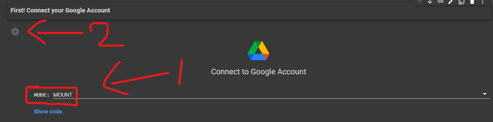
<h4><b> 3.Now run the Timeout preventer to prevent Google Colab from getting Time out!</h4>
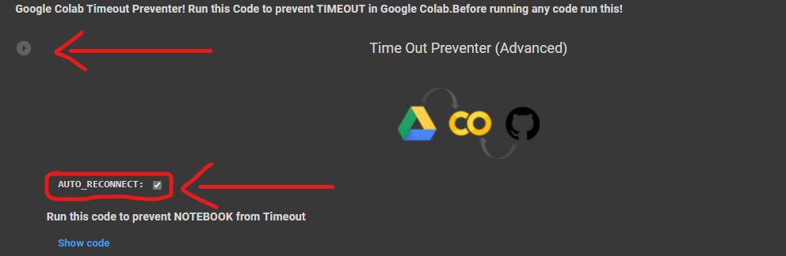
<h4><b> 4.After that! Choose any one Process you want to do based on the Movement(Higlighted in Blue) you want to do! Click the DropDown(Red Box) Arrow as shown in the Image to open a particular option.</h4>

<h3>📂Unzip/Unrar/Untar Files: My Drive to My Drive</h3>
<h4><b> 5.First! Open the "Unzip/Unrar/Untar Files: My Drive to My Drive" section by clicking Dropdown Arrow as shown in The Image.</h4>
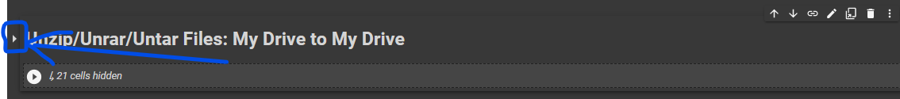
<h4> 6.Now Based on the File type you like to Extract choose anyone option and again click Drop Down Arrow.</h4>
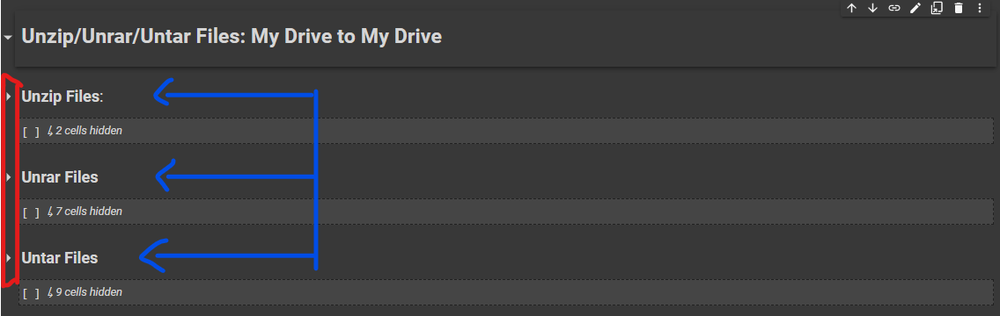
<h4> 7.If you want to extract a file which is in (.Zip) file format then Replace the "FILE NAME" with name of File which needs to be unzipped! For this the File must be present in My Drive.</h4>
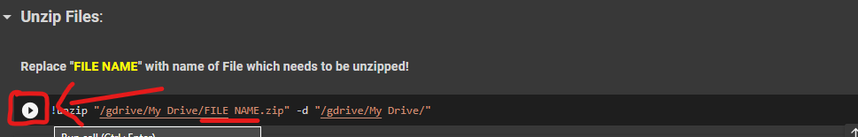
<h4> 8.If you want to extract a RAR file (without password) then Replace the "FILE NAME" with name of File which needs to be UnRAR! For this the File must be present in My Drive.</h4>
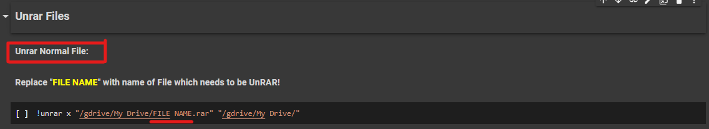
<h4> 9.Or, If you want to extract the RAR file Protected by password then go to "UnRAR Password Protected File:" and Replace "FILE NAME" with name of File which needs to be UnRAR! After running the Code a Field will be visible Enter password there to extract.For this the File must be present in My Drive.</h4>
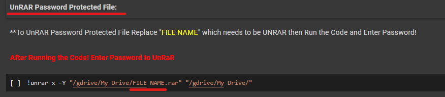
<h4> 10.If you want to extract the (.Tar) file then Replace the "FILE NAME" with name of File which needs to be UnTar! For this the File must be present in My Drive.</h4>
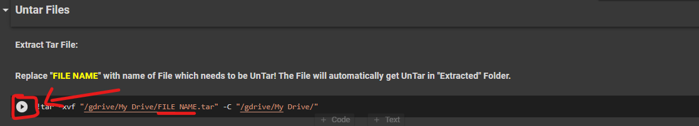
<h4> 11.If you want to extract the (.Tar.gz) file then Replace the "FILE NAME" with name of File which needs to be UnTar.gz! For this the File must be present in My Drive.</h4>
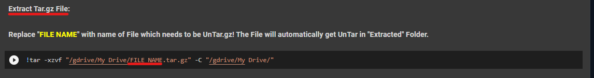
<h4> 12.And if you want to extract the (.Tar.bz2) file then Replace the "FILE NAME" with name of File which needs to be UnTar.bz2! For this the File must be present in My Drive.</h4>
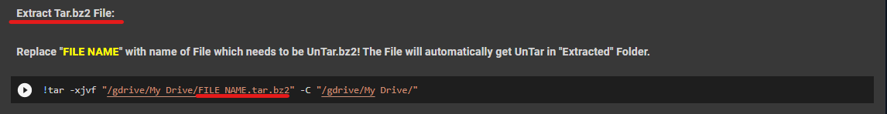
<h3>📁Zip/Rar/Tar Files/Folders: My Drive to My Drive</h3>
<h4> 13.First! Open the "Zip/Rar/Tar Files/Folders: My Drive to My Drive" section by clicking Dropdown Arrow as shown in The Image.</h4>
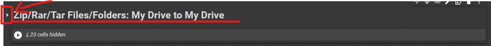
<h4> 14.Now Based on the format type you like to pack your file. Choose anyone option and again click Drop Down Arrow.</h4>
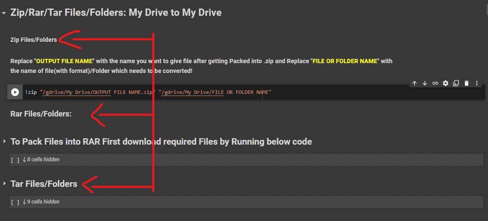
<h4> 15.If you want to pack a file or folder into (.Zip) then Replace "OUTPUT FILE NAME" with the name you want to give file after getting Packed into .zip and Replace "FILE OR FOLDER NAME" with the name of file(with format)/Folder which needs to be converted!</h4>

 <i>If you want to pack a single file then type name with format like "file_name.mp4"</i>

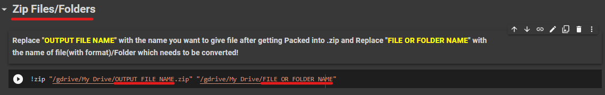
<h4> 16.If you want to pack a file or folder into (.RAR) then first you have to download required setup files by using the as shown in the Image.</h4>
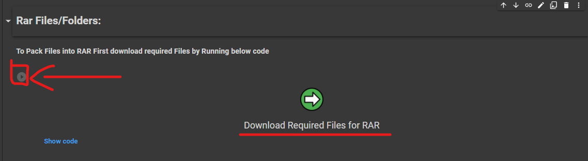
<h4> 17.Now after that! If you want to make pack file/folder into Password protected (.RAR) file then go to "Make Password Protected RAR File:" Section and Replace "OUTPUT FILE NAME" with the name you want to give file after getting Packed into .RAR and Replace "FILE OR FOLDER NAME" with the name of file (with format)/folder which needs to be converted! Then run the Code and provide Password in the INPUT FIELD.</h4>

<i>After Running the Code! Enter Password to set it with the File!</i>

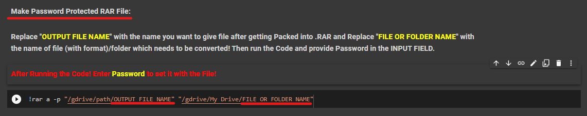
<h4> 18.Or, if you want to pack file/folder into (.RAR) file without password then go to "Make Normal RAR File:" section and Replace "OUTPUT FILE NAME" with the name you want to give file after getting Packed into .RAR and Replace "FILE OR FOLDER NAME" with the name of file(with format)/Folder which needs to be converted!</h4>
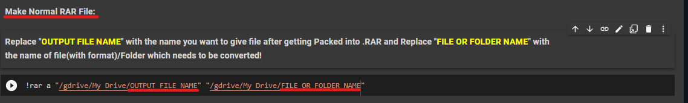
<h4> 19.If you want to pack file/folder into (.Tar) file then Replace "OUTPUT FILE NAME" with the name you want to give file after getting Packed into .Tar and Replace "FILE OR FOLDER NAME" with the name of file(with format)/Folder which needs to be converted!</h4>
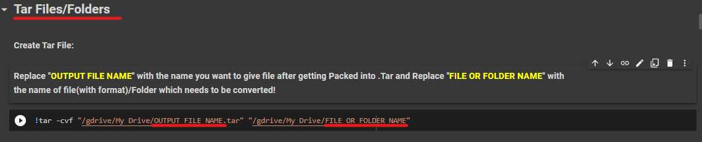
<h4> 20.If you want to pack file/folder into (.Tar.gz) file then Replace "OUTPUT FILE NAME" with the name you want to give file after getting Packed into .Tar.gz and Replace ""FILE OR FOLDER NAME" with the name of file(with format)/Folder which needs to be converted!</h4>
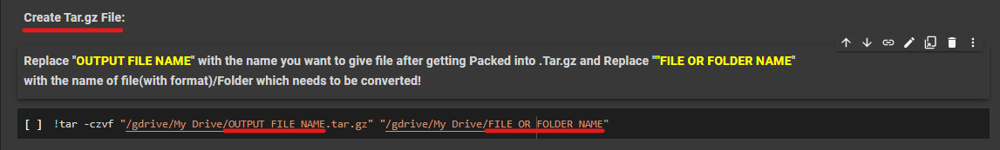
<h4> 21.If you want to pack file/folder into (.Tar.bz2) file then Replace "OUTPUT FILE NAME" with the name you want to give file after getting Packed into .Tar.bz2 and Replace "FILE OR FOLDER NAME" with the name of file(with format)/Folder which needs to be converted!</h4>
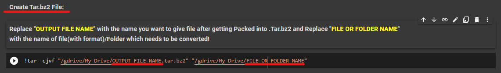
<h3>🗂️Unzip/Unrar/Untar Files: Shared Drive to Shared Drive</h3>
<h4> 1.First! Open the "Unzip/Unrar/Untar Files: Shared Drive to Shared Drive" section by clicking Dropdown Arrow as shown in The Image.</h4>
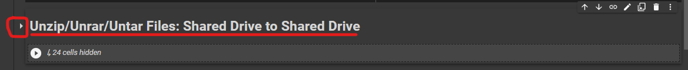
<h4> 2.Since you are going to Extract file/folder which are located in Shared Drives! You need to Enter exact correct name of Shard Drives also. So for that run the code as shown in the Image and get the name of Shared drives and copy them without (' ')</h4>
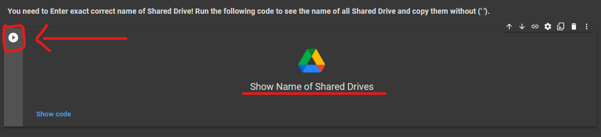
<h4> 3.Now Based on the File type you like to Extract choose anyone option and again click Drop Down Arrow.</h4>
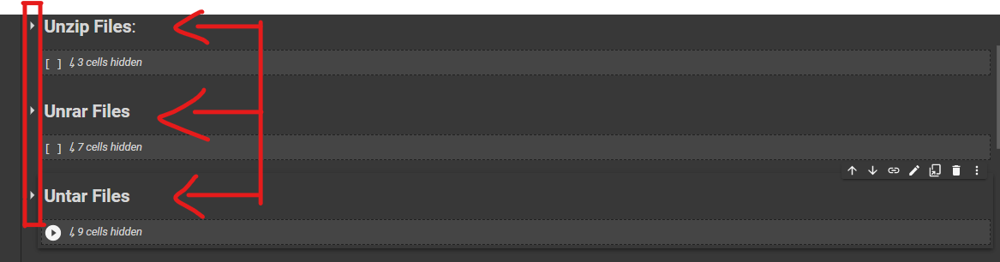
<h4> 4.If you want to extract a file which is in (.Zip) file format then Replace "SHARED DRIVE NAME1" from the Name of Shared Drive from which the file needs to be Unzipped and Replace "FILE NAME" with name of File which needs to be Unzipped. Replace "SHARED DRIVE NAME2" with the Name of Shared Drive in to which Extracted file needs to be send!</h4>

  <i>You can also use Same Shared Drive name at place of "SHARED DRIVE NAME1" and "SHARED DRIVE NAME2"</i>

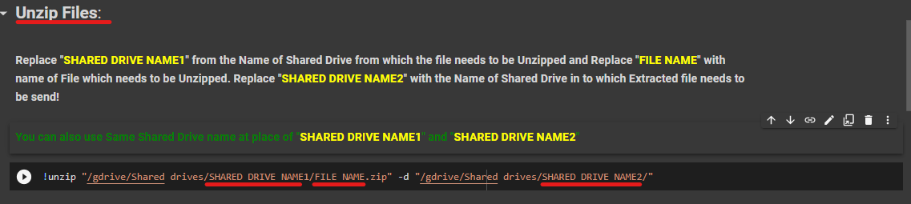
<h4> 5.If you want to extract a RAR file (without password) then Replace "SHARED DRIVE NAME1" from the Name of Shared Drive from which the file needs to be UnRaR and Replace "FILE NAME" with name of File which needs to be Unzipped. Replace "SHARED DRIVE NAME2" with the Name of Shared Drive in to which Extracted file needs to be send!</h4>
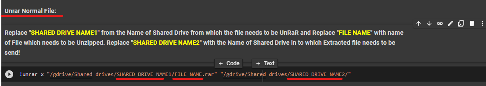
<h4> 6.Or, If you want to extract the RAR file Protected by password then go to "UnRAR Password Protected File:" and Replace "SHARED DRIVE NAME1" from the Name of Shared Drive from which the file needs to be UnRaR and Replace "FILE NAME" with name of File which needs to be Unzipped. Replace "SHARED DRIVE NAME2" with the Name of Shared Drive in to which Extracted file needs to be send!</h4>

<i>After Running the Code! Enter Password to UnRaR</i>

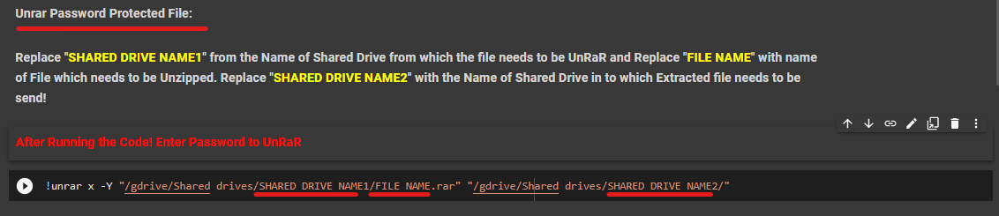
<h4> 7.If you want to extract the (.Tar) file then Replace "SHARED DRIVE NAME1" from the Name of Shared Drive from which the file needs to be UnTar and Replace "FILE NAME" with name of File which needs to be Unzipped. Replace "SHARED DRIVE NAME2" with the Name of Shared Drive in to which Extracted file needs to be send!</h4>
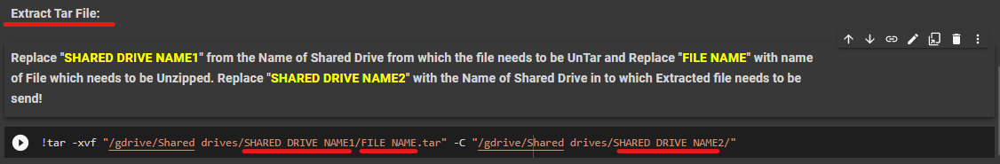
<h4> 8.If you want to extract the (.Tar.gz) file then Replace "SHARED DRIVE NAME1" from the Name of Shared Drive from which the file needs to be UnTar.gz and Replace "FILE NAME" with name of File which needs to be UnTar.gz . Replace "SHARED DRIVE NAME2" with the Name of Shared Drive in to which Extracted file needs to be send!</h4>
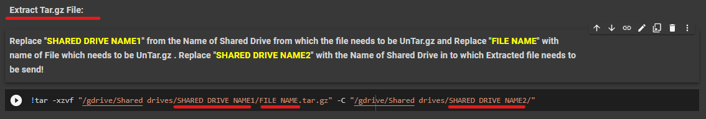
<h4> 9.And if you want to extract the (.Tar.bz2) file then Replace "SHARED DRIVE NAME1" from the Name of Shared Drive from which the file needs to be UnTar.bz2 and Replace "FILE NAME" with name of File which needs to be UnTar.bz2 . Replace "SHARED DRIVE NAME2" with the Name of Shared Drive in to which Extracted file needs to be send!</h4>
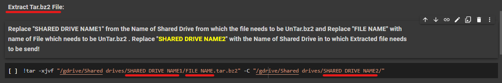
<h3>📁Zip/Rar/Tar Files/Folders: Shared Drive to Shared Drive</h3>
<h4> 10.First! Open the "Zip/Rar/Tar Files/Folders: Shared Drive to Shared Drive" section by clicking Dropdown Arrow as shown in The Image.</h4>
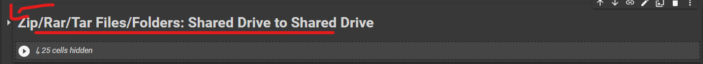
<h4> 11.Since you are going to pack file/folder which are located in Shared Drives! You need to Enter exact correct name of Shard Drives also. So for that run the code as shown in the Image and get the name of Shared drives and copy them without (' ')</h4>
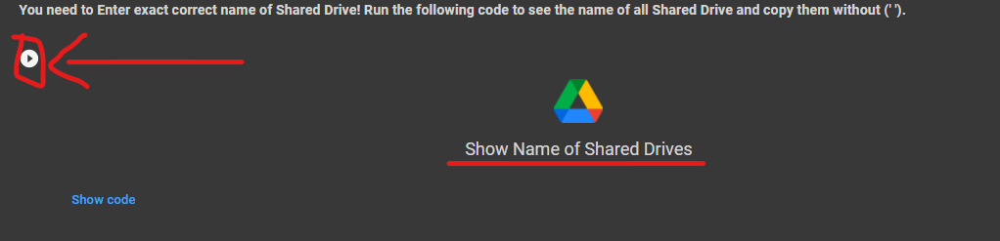
<h4> 12.Now Based on the format type you like to pack your file. Choose anyone option and again click Drop Down Arrow.</h4>
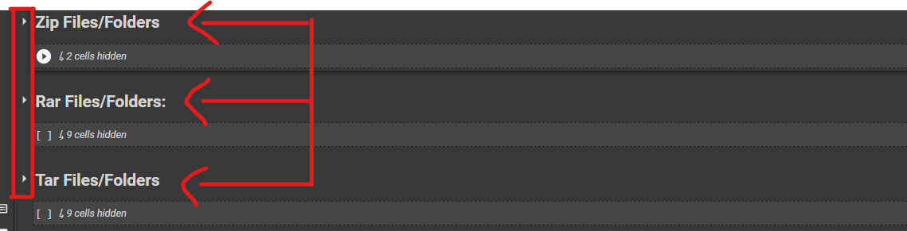
<h4> 13.If you want to pack a file or folder into (.Zip) then Replace "SHARED DRIVE NAME1" from the Name of Shared Drive from which the file needs to be Zipped and Replace "SHARED DRIVE NAME2" in which you want Final zipped file to be send.Replace "OUTPUT FILE NAME" with the name which you want of Final Zipped File. Replace "FILE OR FOLDER NAME" with name of File(with format)/Folder which needs to be zipped.</h4>
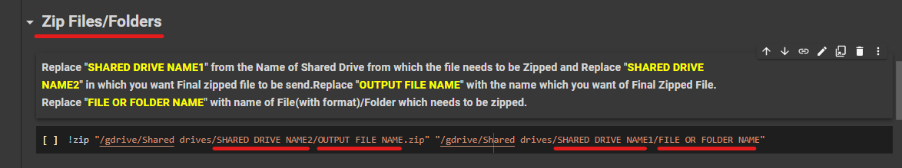
<h4> 14.If you want to pack a file or folder into (.RAR) then first you have to download required setup files by using the as shown in the Image.</h4>
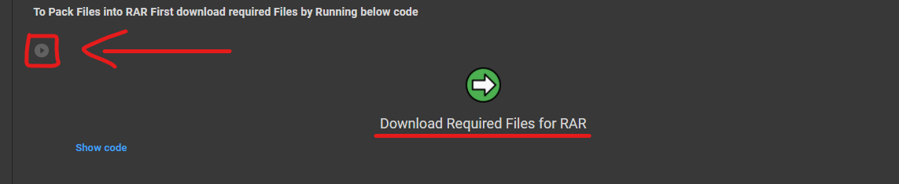
<h4> 15.Now after that! If you want to make pack file/folder into Password protected (.RAR) file then go to "Make Password Protected RAR File:" Section and Replace "SHARED DRIVE NAME1" from the Name of Shared Drive from which the file needs to be RAR and Replace "SHARED DRIVE NAME2" in which you want Final RARED file to be send.Replace "OUTPUT FILE NAME" with the name which you want of Final RAR File. Replace "FILE OR FOLDER NAME" with name of File(with format)/Folder which needs to be RARED.</h4>

 <i>After Running the Code! Enter Password to set it with the File!</i>

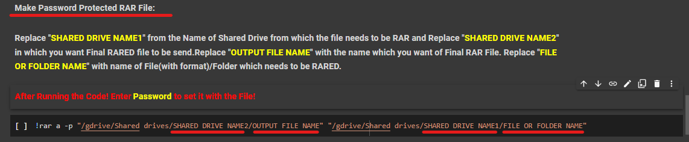
<h4> 16.Or, if you want to pack file/folder into (.RAR) file without password then go to "Make Normal RAR File:" section and Replace "SHARED DRIVE NAME1" from the Name of Shared Drive from which the file needs to be RAR and Replace "SHARED DRIVE NAME2" in which you want Final RARED file to be send.Replace "OUTPUT FILE NAME" with the name which you want of Final RAR File. Replace "FILE OR FOLDER NAME" with name of File(with format)/Folder which needs to be RARED. </h4>
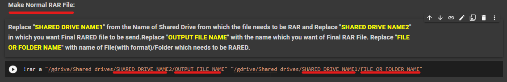
<h4> 17.If you want to pack file/folder into (.Tar) file then Replace "SHARED DRIVE NAME1" from the Name of Shared Drive from which the file needs to be TAR and Replace "SHARED DRIVE NAME2" in which you want Final TARED file to be send.Replace "OUTPUT FILE NAME" with the name which you want of Final TAR File. Replace "FILE OR FOLDER NAME" with name of File(with format)/Folder which needs to be TARED.</h4>
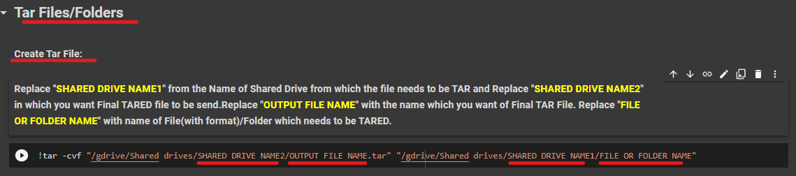
<h4> 18.If you want to pack file/folder into (.Tar.gz) file then Replace "SHARED DRIVE NAME1" from the Name of Shared Drive from which the file needs to be TAR.gz and Replace "SHARED DRIVE NAME2" in which you want Final TAR.gz file to be send.Replace "OUTPUT FILE NAME" with the name which you want of Final TAR.gz File. Replace "FILE OR FOLDER NAME" with name of File(with format)/Folder which needs to be TAR.gz.</h4>
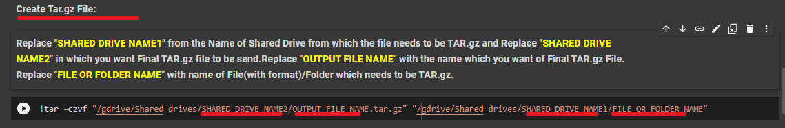
<h4> 19.If you want to pack file/folder into (.Tar.bz2) file then Replace "SHARED DRIVE NAME1" from the Name of Shared Drive from which the file needs to be TAR.bz2 and Replace "SHARED DRIVE NAME2" in which you want Final TAR.bz2 file to be send.Replace "OUTPUT FILE NAME" with the name which you want of Final TAR.bz2 File. Replace "FILE OR FOLDER NAME" with name of File(with format)/Folder which needs to be TAR.bz2.</h4>
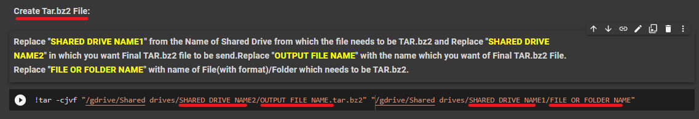
<h3>🎴Unzip/Unrar/Untar Files: My Drive to Shared Drive</h3>
<h4> 1.First! Open the "Unzip/Unrar/Untar Files: My Drive to Shared Drive" section by clicking Dropdown Arrow as shown in The Image.</h4>
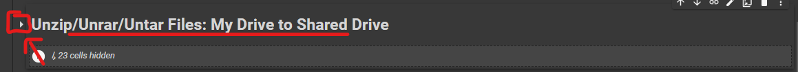
<h4> 2.Since you are going to Extract file/folder and sending it to Shared Drives! You need to Enter exact correct name of Shard Drives also. So for that run the code as shown in the Image and get the name of Shared drives and copy them without (' ')</h4>
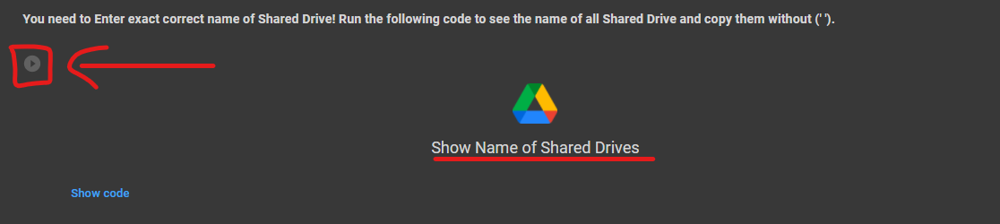
<h4> 3.Now Based on the File type you like to Extract choose anyone option and again click Drop Down Arrow.</h4>
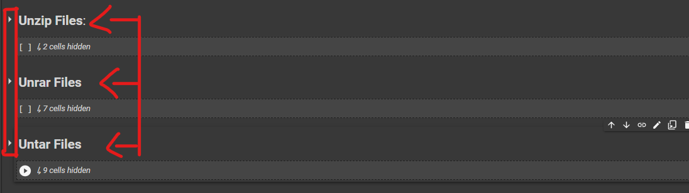
<h4> 4.If you want to extract a file which is in (.Zip) file format then Replace "FILE NAME" with name of File which needs to be Unzipped. Replace "SHARED DRIVE NAME2" with the Name of Shared Drive in to which Extracted file needs to be send!</h4>
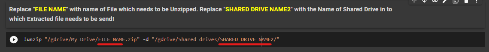
<h4> 5.If you want to extract a RAR file (without password) then Replace "FILE NAME" with name of File which needs to be UnRAR. Replace "SHARED DRIVE NAME2" with the Name of Shared Drive in to which Extracted file needs to be send!</h4>
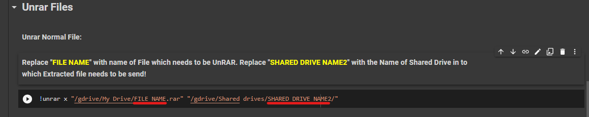
<h4> 6.Or, If you want to extract the RAR file Protected by password then go to "UnRAR Password Protected File:" and Replace "FILE NAME" with name of File which needs to be UnRAR. Replace "SHARED DRIVE NAME2" with the Name of Shared Drive in to which Extracted file needs to be send!</h4>

After Running the Code! Enter Password to UnRaR</i>

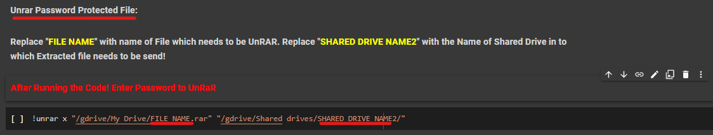
<h4> 7.If you want to extract the (.Tar) file then Replace "FILE NAME" with name of File which needs to be UnTar. Replace "SHARED DRIVE NAME2" with the Name of Shared Drive in to which Extracted file needs to be send!</h4>
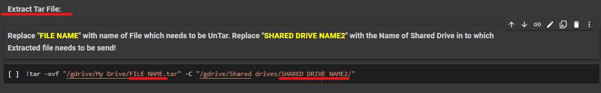
<h4> 8.If you want to extract the (.Tar.gz) file then Replace "FILE NAME" with name of File which needs to be UnTar.gz. Replace "SHARED DRIVE NAME2" with the Name of Shared Drive in to which Extracted file needs to be send!</h4>
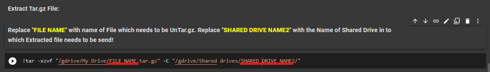
<h4> 9.And if you want to extract the (.Tar.bz2) file then Replace "FILE NAME" with name of File which needs to be UnTar. Replace "SHARED DRIVE NAME2" with the Name of Shared Drive in to which Extracted file needs to be send!</h4>
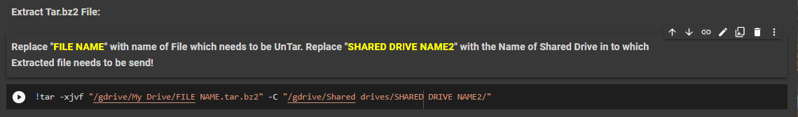
<h3>📇Zip/Rar/Tar Files/Folders: My Drive to Shared Drive</h3>
<h4> 10.First! Open the "Zip/Rar/Tar Files/Folders: My Drive to Shared Drive" section by clicking Dropdown Arrow as shown in The Image.</h4>
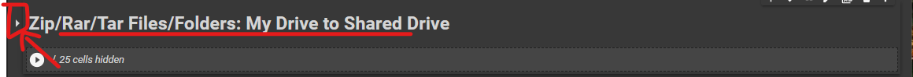
<h4> 11.Since you are going to pack file/folder and sending it to Shared Drives! You need to Enter exact correct name of Shard Drives also. So for that run the code as shown in the Image and get the name of Shared drives and copy them without (' ')</h4>
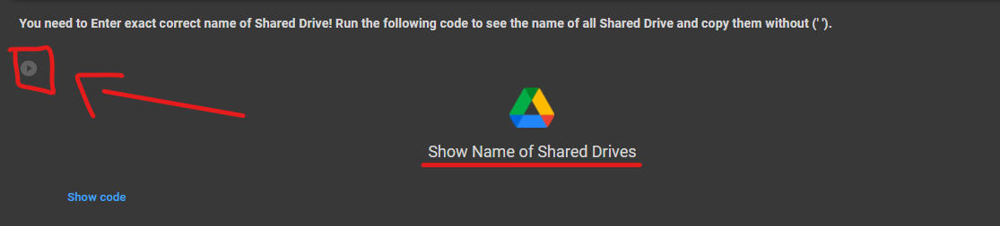
<h4> 12.Now Based on the format type you like to pack your file. Choose anyone option and again click Drop Down Arrow.</h4>
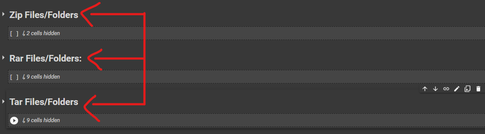
<h4> 13.If you want to pack a file or folder into (.Zip) then Replace "SHARED DRIVE NAME2" in which you want Final zipped file to be send.Replace "OUTPUT FILE NAME" with the name which you want of Final Zipped File. Replace "FILE OR FOLDER NAME" with name of File(with format)/Folder which needs to be zipped.</h4>

<h4> 14.If you want to pack a file or folder into (.RAR) then first you have to download required setup files by using the as shown in the Image.</h4>

<h4> 15.Now after that! If you want to make pack file/folder into Password protected (.RAR) file then go to "Make Password Protected RAR File:" Section and Replace "SHARED DRIVE NAME2" in which you want Final RAR file to be send.Replace "OUTPUT FILE NAME" with the name which you want of Final RARED File. Replace "FILE OR FOLDER NAME" with name of File(with format)/Folder which needs to be RARED. </h4>

<i>After Running the Code! Enter Password to set it with the File!</i>

<h4> 16.Or, if you want to pack file/folder into (.RAR) file without password then go to "Make Normal RAR File:" section and Replace "SHARED DRIVE NAME2" in which you want Final RAR file to be send.Replace "OUTPUT FILE NAME" with the name which you want of Final RARED File. Replace "FILE OR FOLDER NAME" with name of File(with format)/Folder which needs to be RARED.</h4>

<h4> 17.If you want to pack file/folder into (.Tar) file then Replace "SHARED DRIVE NAME2" in which you want Final TARED file to be send.Replace "OUTPUT FILE NAME" with the name which you want of Final TAR File. Replace "FILE OR FOLDER NAME" with name of File(with format)/Folder which needs to be TARED.</h4>

<h4> 18.If you want to pack file/folder into (.Tar.gz) file then Replace "SHARED DRIVE NAME2" in which you want Final TAR.gz file to be send.Replace "OUTPUT FILE NAME" with the name which you want of Final TAR.gz File. Replace "FILE OR FOLDER NAME" with name of File(with format)/Folder which needs to be TAR.gz.</h4>

<h4> 19.If you want to pack file/folder into (.Tar.bz2) file then Replace "SHARED DRIVE NAME2" in which you want Final TAR.bz2 file to be send.Replace "OUTPUT FILE NAME" with the name which you want of Final TAR.bz2 File. Replace "FILE OR FOLDER NAME" with name of File(with format)/Folder which needs to be TAR.bz2.</h4> <!---#Img Missing HERE--->

<h3>🗄️Unzip/Unrar/Untar Files: Shared Drive to My Drive</h3>
<h4> 1.First! Open the "Unzip/Unrar/Untar Files: Shared Drive to My Drive" section by clicking Dropdown Arrow as shown in The Image.</h4>

<h4> 2.Since you are going to Extract file/folder and sending it to Shared Drives! You need to Enter exact correct name of Shard Drives also. So for that run the code as shown in the Image and get the name of Shared drives and copy them without (' ')</h4>

<h4> 3.Now Based on the File type you like to Extract choose anyone option and again click Drop Down Arrow.</h4>

<h4> 4.If you want to extract a file which is in (.Zip) file format then Replace "FILE NAME" with name of File which needs to be Unzipped. Replace "SHARED DRIVE NAME1" with the Name of Shared Drive from which file (To be Extracted) needs to be taken!</h4>

<h4> 5.If you want to extract a RAR file (without password) then Replace "FILE NAME" with name of File which needs to be UnRAR. Replace "SHARED DRIVE NAME1" with the Name of Shared Drive from which file (To be Extracted) needs to be taken!</h4>

<h4> 6.Or, If you want to extract the RAR file Protected by password then go to "UnRAR Password Protected File:" and Replace "FILE NAME" with name of File which needs to be UnRAR. Replace "SHARED DRIVE NAME1" with the Name of Shared Drive from which file (To be Extracted) needs to be taken!</h4>

<i>After Running the Code! Enter Password to UnRaR</i>

<h4> 7.If you want to extract the (.Tar) file then Replace "FILE NAME" with name of File which needs to be UnTar. Replace "SHARED DRIVE NAME1" with the Name of Shared Drive from which file (To be Extracted) needs to be taken!</h4>

<h4> 8.If you want to extract the (.Tar.gz) file then Replace "FILE NAME" with name of File which needs to be UnTar.gz. Replace "SHARED DRIVE NAME1" with the Name of Shared Drive from which file (To be Extracted) needs to be taken!</h4>

<h4> 9.And if you want to extract the (.Tar.bz2) file then Replace "FILE NAME" with name of File which needs to be UnTar.bz2. Replace "SHARED DRIVE NAME1" with the Name of Shared Drive from which file (To be Extracted) needs to be taken!</h4>

<h3 alt="Second Last">🗂️Zip/Rar/Tar Files/Folders: Shared Drive to My Drive</h3>
<h4> 10.First! Open the "Zip/Rar/Tar Files/Folders: Shared Drive to My Drive" section by clicking Dropdown Arrow as shown in The Image.</h4>

<h4> 11.Since you are going to pack file/folder and sending it to Shared Drives! You need to Enter exact correct name of Shard Drives also. So for that run the code as shown in the Image and get the name of Shared drives and copy them without (' ')</h4>

<h4> 12.Now Based on the format type you like to pack your file. Choose anyone option and again click Drop Down Arrow.</h4>

<h4> 13.If you want to pack a file or folder into (.Zip) then Replace "OUTPUT FILE NAME" with the name which you want of Final Zipped File."SHARED DRIVE NAME1" with the Name of Shared Drive from which file (To be Zipped) needs to be taken! Replace "FILE OR FOLDER NAME" with File(with Format)/Folder name which needs to be zipped</h4>

<h4> 14.If you want to pack a file or folder into (.RAR) then first you have to download required setup files by using the as shown in the Image.</h4>

<h4> 15.Now after that! If you want to make pack file/folder into Password protected (.RAR) file then go to "Make Password Protected RAR File:" Section and Replace "OUTPUT FILE NAME" with the name which you want of Final RAR File."SHARED DRIVE NAME1" with the Name of Shared Drive from which file (To be RARED) needs to be taken! Replace "FILE OR FOLDER NAME" with File(with Format)/Folder name which needs to be RARED</h4>

<i>After Running the Code! Enter Password to set it with the File!</i>

<h4> 16.Or, if you want to pack file/folder into (.RAR) file without password then go to "Make Normal RAR File:" section and Replace "OUTPUT FILE NAME" with the name which you want of Final RAR File."SHARED DRIVE NAME1" with the Name of Shared Drive from which file (To be RARED) needs to be taken! Replace "FILE OR FOLDER NAME" with File(with Format)/Folder name which needs to be RARED/h4>

<h4> 17.If you want to pack file/folder into (.Tar) file then Replace "OUTPUT FILE NAME" with the name which you want of Final TAR File."SHARED DRIVE NAME1" with the Name of Shared Drive from which file (To be TAR) needs to be taken! Replace "FILE OR FOLDER NAME" with File(with Format)/Folder name which needs to be TAR</h4>

<h4> 18.If you want to pack file/folder into (.Tar.gz) file then Replace "OUTPUT FILE NAME" with the name which you want of Final TAR.gz File."SHARED DRIVE NAME1" with the Name of Shared Drive from which file (To be TAR.gz) needs to be taken! Replace "FILE OR FOLDER NAME" with File(with Format)/Folder name which needs to be TAR.gz</h4>

<h4> 19.If you want to pack file/folder into (.Tar.bz2) file then Replace "OUTPUT FILE NAME" with the name which you want of Final TAR.bz2 File."SHARED DRIVE NAME1" with the Name of Shared Drive from which file (To be TAR.bz2) needs to be taken! Replace "FILE OR FOLDER NAME" with File(with Format)/Folder name which needs to be TAR.bz2</h4>

<h3>🖥️Advanced Packing and Unpacking</h3>
<h4><b>Integreated packing whole shared drive into Zip, RaR at once!</b></h4>
<h4>To pack all data of a particular Shared Drive into a particular Format then Use:</h4>

~~~ 
/gdrive/Shared drives/SHARED DRIVE NAME1/ # As the Source  
/gdrive/Shared drives/SHARED DRIVE NAME2/ #As the Destination or, 
Use My Drive as a destination: 
/gdrive/My Drive/  
~~~

<h2>〽️Variables Used</h2>
<h4>1.SHARED DRIVE NAME1: Replace from the Name of Shared Drive from which the file needs to be taken.</h4>
<h4>2.SHARED DRIVE NAME2: Replace from the Name of Shared Drive in which final output needs to be stored.</h4>
<h4>3.OUTPUT FILE NAME: Name of the Final output file after processing it.</h4>
<h4>4.FILE OR FOLDER NAME: The Name of File (with format) or Folder which needs to be processed.</h4>
<h4>5.PASSWORD: The password for unpacking or packing a particular file.</h4>
<h2>📑Packages Used</h2>
<h4>1.RAR Packages: For packing files.</h4>
<h2>🎯Points to be Noted🎯</h2>
<h4>1.Every Variable used in this NoteBook is Highlighted with "Yellow" colour.</h4>
<h4>2.Some Scripts are added to solve Input error caused by user like not entering .zip or .tar while packing.</h4>
<h4>3.While packing anything in (.RAR) there is no need to put .rar because package will automatically put it.</h4>
<h4>4.If user do not provide or do a mistake in format while packing then alogorithm will try the same with "Filename" or "Filename.format"</h4>
<h4>5.While unpacking (.RAR), User needs to enter Password after running the Code.</h4>
<h4>6.Making password protected (.RAR), User needs to enter Password after running the Code.</h4>
<h4>7.Time of Packing or Unpacking depends upon the size of the File or Folder.</h4>
<h4>8.No risk of Data Corruption.</h4>
<h4>9.Google will not able to Flag a copyright file if you pack it into .RAR with password.</h4>
<h4>10.Don't forget to remember the password set by you while packing anything.</h4>
<h2> 🔐 Safe or Not? ✅</h2>
<h4> 1.Don't Worry! No data will be shared with anyone, if you use the <a href="https://github.com/TheCaduceus/Packer-and-Extractor-of-Google-Drive">Original code</a>.🔒</h4>
<h4> 2.This will not cause any type of Data corruption!🔑</h4>
<h4> 3.Do not trust any other copy of this Code.📚</h4>
<h2> 🤔 Why Use This?</h2>
<h4>Sometimes the Google Flag some of your copyright file and make it unusable but by packing it into .RAR or .Zip the Google will not able to read it and hence you can store it and share it without any problem of account termination also before downloading anything you can check what is inside of that package and If you use Google Collab for Long term use, then you can understand that it requires Human Interaction atleast one time per 90 Minutes! Otherwise it will cancel the task and all your Work will got failed! But this Repository comes with the code which prevent this. Yes you heard it right just click on the "Play Code Button" of "Timeout Preventer" and then don't worry about time out! Sometimes the Users found to handle Google Colab defficult so we have designed a Simple and Advanced UI for them. We update every Repository on a regular Basis and fix Problems reported to us by our Users!</h4>
<h2> 📥Download</h2>
<h4> You can also Download this GitHub Repository as (.zip) file:</h4>
<h4> <a href="https://github.com/TheCaduceus/Packer-and-Extractor-of-Google-Drive/archive/refs/heads/main.zip">Download Now</a></h4>
<h2>⛑Contact Us!</h2>
<h4>Checkout our Website for more: <a href="https://www.caduceus.ml/">Open it!</a></h4>
<h4>Join our Update Channel at Telegram:<a href="https://telegram.me/TheCaduceusUPDATE"> Join Now!</a>
<h4>Directly Contact the Developer using Telegram <a href="https://telegram.me/HelpAutomatted_Bot">@HelpAutomatted_Bot</a></h4>
<h2>❤️Credits & Thanks</h2>

<a href="https://github.com/TheCaduceus">Dr.Caduceus</a>: For making UI and Collab Notebook.

